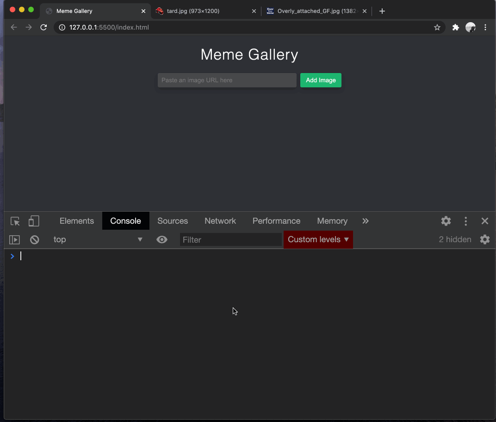
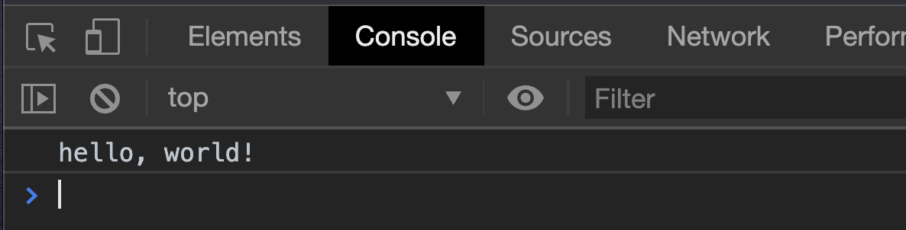
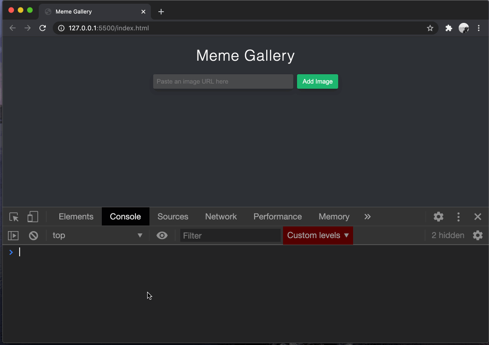
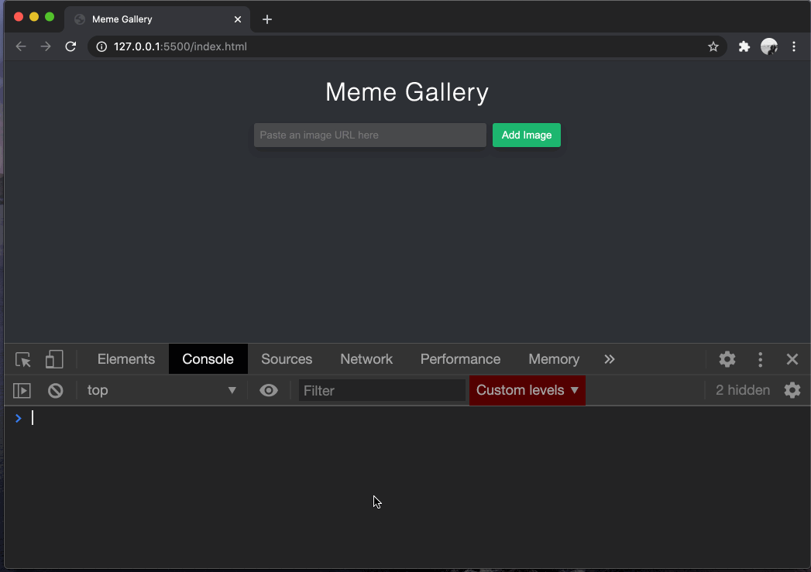
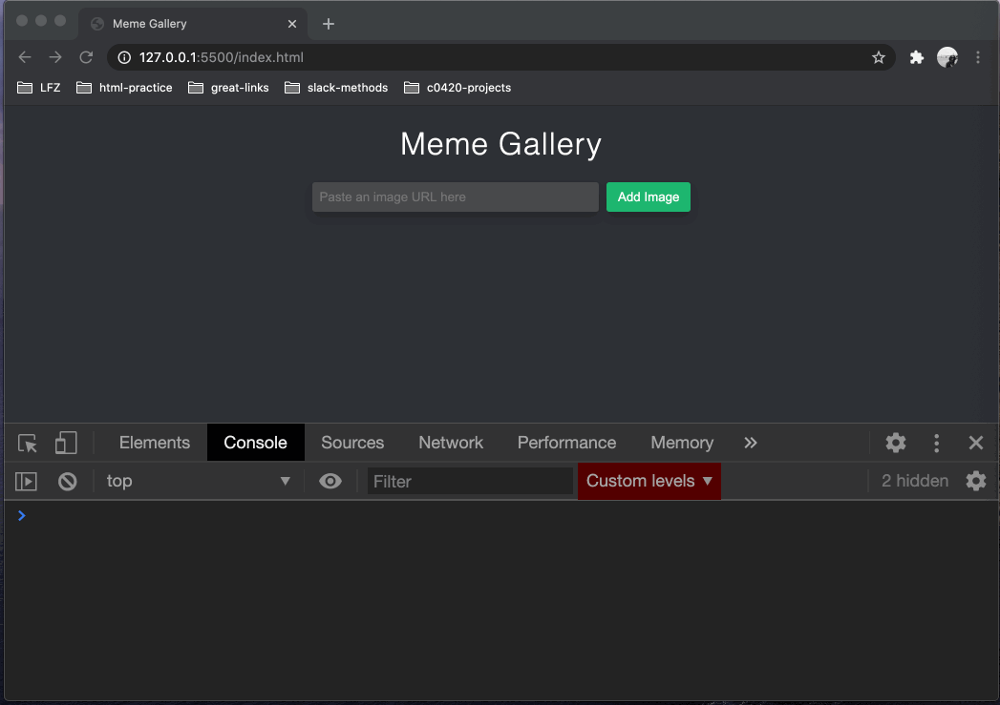
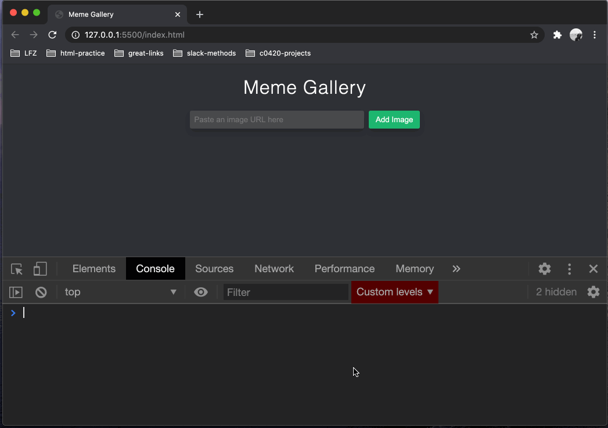

# Accepting User Input

Our app will be displaying images that the user chooses. We've included a nice text input and a button for them to click, but at the moment, they don't do anything.

This section of the project will walk you through building up functionality using JavaScript so that the app can record information supplied by the user.

We won't actually _do_ anything with the user input yet, not until we know we can store it!

Here's a preview of where we're headed!

<p align="middle">
  
</p>

As you can see, we will have an array named `imageUrls`. When the user puts a URL into the input and clicks on the button. The URL they entered will be put into the `imageUrls` array. If you have eagle eyes, you may have noticed that the input gets emptied out too.

Let's-a-go!

## Add a JavaScript File

Before we go any further, we'll actually need a JavaScript file to work in.

1. Create a new file in your project named `"main.js"`.
1. Add a `<script>` tag just before the **closing** `</body>` tag in your HTML document. The `<script>` tag should have an `src` attribute set to `"main.js"` (the name of your JavaScript file).
1. In `main.js` write a `console.log('hello, world!')`. This will help us make sure that our JavaScript is loading properly.
1. Open `index.html` in your browser and check the console. Your `hello, world!` should be printed.

<p align="middle">
  
</p>

## Grab the `input` and `button` with JavaScript

The user will be interacting with two elements of our document, the `input` and the `button`. So we need to make sure that our JavaScript can keep track of them.

1. In `main.js`, delete your `console.log()` since we now know that the JavaScript file is loading properly.
1. [Use `document.querySelector()`](https://github.com/Learning-Fuze/lfz-prep-lessons/tree/master/exercises/javascript-dom-manipulation-1) to grab the `input` and store its return value in a variable named `imageUrlInput`.
1. Use `document.querySelector()` to grab the `button` and store its return value in a variable named `addImageButton`.
1. Reload your `index.html` in the browser and check to see if you can read those variables in the console like so:

    <p align="middle">
      
    </p>

## Listen for Clicks

The next thing we're going to do is make sure that our application reacts when the user clicks on the button. At first, we should just see if we can make _anything_ happen when the user clicks the button!

1. Now that you have the button inside `addImageButton`, [add an event listener to it](https://github.com/Learning-Fuze/lfz-prep-lessons/tree/master/exercises/javascript-events) that simply logs `'click detected!'` to the console.
    <p align="middle">
      
    </p>
1. When your click event listener is properly logging `'click detected!'` to the console, modify your `console.log()` to print [the `value` property of your `imageUrlInput`](https://www.w3schools.com/jsref/prop_text_value.asp) instead. If you put something into the input on the page, it should be logged like this:
    <p align="middle">
      
    </p>

## Store the URLs

Now, we want our app to remember all of the URLs that the user is entering, so we are going to store them in a JavaScript array.

1. At the top of your `main.js`, [create an empty array](https://github.com/Learning-Fuze/lfz-prep-lessons/tree/master/exercises/javascript-arrays) and assign it to a variable named `imageUrls`.
1. Next, add a line of code to your event listener that calls [the push method of your `imageUrls`](https://www.w3schools.com/jsref/jsref_push.asp), passing in the `value` property of your `imageUrlInput` so that when the user clicks the button, the URL they entered is "pushed" into the array. You can check your array before and after clicking the button.
    <p align="middle">
      
    </p>
1. On the next line, assign an empty string to the `value` property of your `imageUrlInput` so that the input element is emptied out after the URL is stored in the array. Here is a demonstration of adding three URLs to the application:
    <p align="middle">
      
    </p>
1. Use [an `if` statement](https://github.com/Learning-Fuze/lfz-prep-lessons/tree/master/exercises/javascript-conditionals-1) to ensure that the user input is only pushed into the array if it is not an empty string.

## Moving On

As you have learned, it's possible to capture information from a user and store it in your application for use later on. In order to do this, we need to leverage the event system built into the DOM.

Now we can get to the payoff where we render the user's image URLs in the [next section](DYNAMICALLY_RENDERING_IMAGES.md).

If you want, you can triple-check your code against a reference solution. **However, if you got stuck, be sure to re-read the instructions _very slowly_ and ask questions of the instructors rather than simply copying these examples.**

### `index.html`

```html
<!DOCTYPE html>
<html lang="en">
<head>
  <meta charset="UTF-8">
  <meta name="viewport" content="width=device-width, initial-scale=1.0">
  <title>Meme Gallery</title>
  <link rel="stylesheet" href="styles.css">
</head>
<body>
  <header>
    <h1>Meme Gallery</h1>
    <input type="url" placeholder="Paste an image URL here">
    <button>Add Image</button>
  </header>
  <main></main>
  <script src="main.js"></script>
</body>
</html>
```

### `main.js`

```js
var imageUrls = [];
var imageUrlInput = document.querySelector('input');
var addImageButton = document.querySelector('button');

addImageButton.addEventListener('click', function (event) {
  if (imageUrlInput.value !== '') {
    imageUrls.push(imageUrlInput.value);
  }
  imageUrlInput.value = ''
});
```
