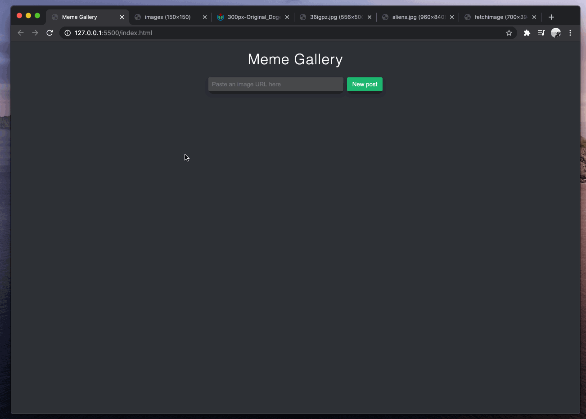
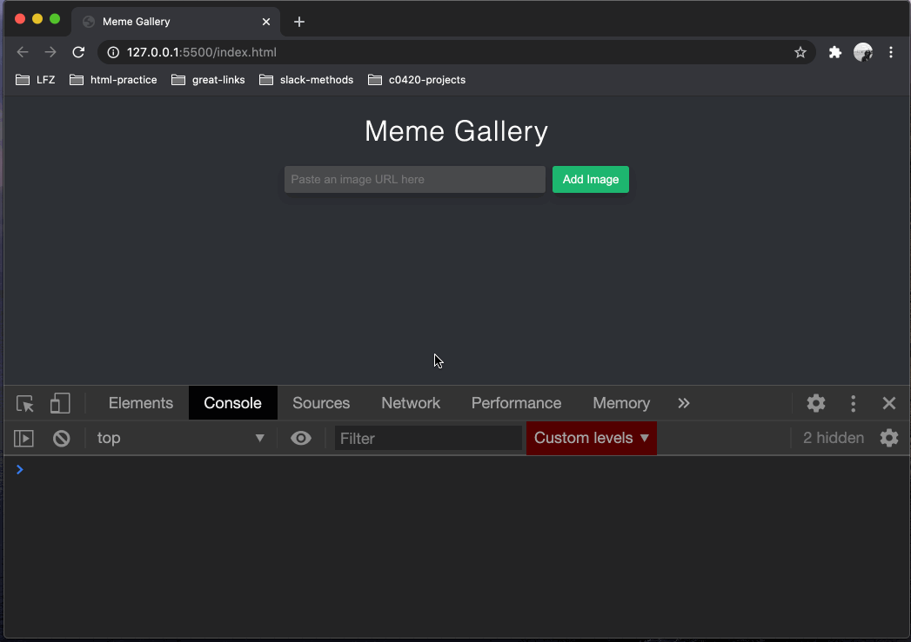
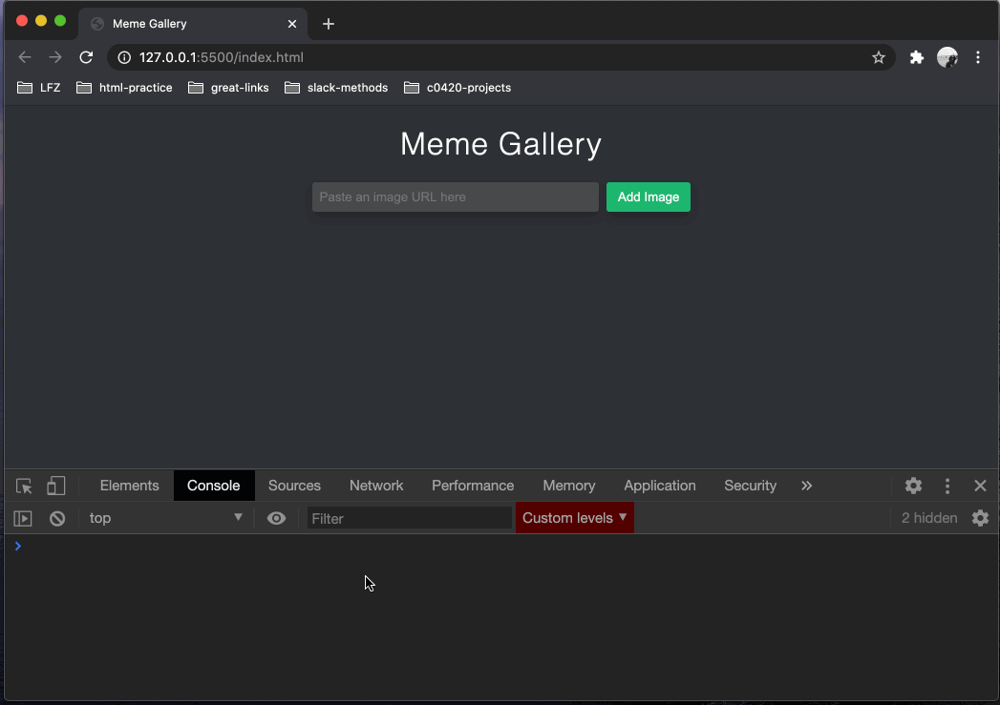
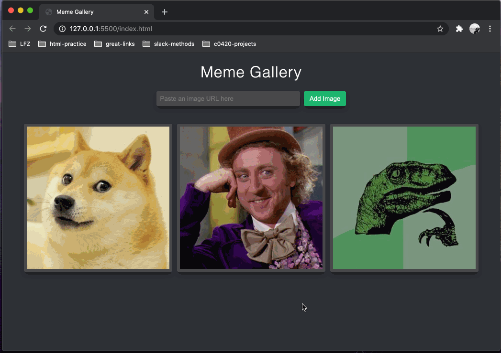

# Dynamically Rendering Images

Great job so far! In this final section of the project, we'll be using the image URLs supplied by the user to populate a gallery!

When you're done, you should be able to populate your gallery by inputting some image URLs!

<p align="middle">
  
</p>

## Dummy Data

In programming, there is a concept called "dummy data". Dummy data is some example data that you use temporarily to help you build your project, so you don't have to keep manually entering new data every time you want to test it.

1. In `main.js`, add three image URLs to your empty `imageUrls` array like so:
    ```js
    var imageUrls = [
      'https://i.kym-cdn.com/entries/icons/original/000/013/564/doge.jpg',
      'https://etcanada.com/wp-content/uploads/2016/06/58c0500b2ac4c342c6fc4ab096ada150.jpg?quality=80&strip=all&crop=0px%2C21px%2C500px%2C333px&resize=720%2C480',
      'https://wiki.godvillegame.com/images/thumb/7/76/Prap.jpg/298px-Prap.jpg'
    ];
    ```
    P.S. you should still be able to add a fourth or fifth URL using your input and button in the browser.

## Looping Through URLs

Generally speaking, a JavaScript program can only do one thing at a time. So we'll need to employ a `for` loop to repeat some steps for each URL in our `imageUrls` array.

1. At the top of your `main.js` file, use `document.querySelector()` to grab the `main` element of your HTML document and store it in a variable named `gallery`. We'll come back to this variable later.
1. At the bottom of your `main.js` file, [define a function](https://github.com/Learning-Fuze/lfz-prep-lessons/tree/master/exercises/javascript-functions) named `updateGallery` that takes no parameters.
1. Within your `updateGallery` function's code block, [use a `for` loop](https://github.com/Learning-Fuze/lfz-prep-lessons/tree/master/exercises/javascript-for-loops) to visit each URL in your `imageUrls` array, and for now, just `console.log()` each of them. You should be able to test your function like so:
    <p align="middle">
      
    </p>
1. Now, remove the `console.log()` from your `for` loop and replace it with the following lines of code:
    - create a new `img` element [with `document.createElement()`](https://github.com/Learning-Fuze/lfz-prep-lessons/tree/master/exercises/javascript-dom-creation-1) and store it in a variable named `imageElement`.
    - [add the class](https://github.com/Learning-Fuze/lfz-prep-lessons/tree/master/exercises/javascript-dom-creation-2) `'gallery-image'` to the `imageElement` (you'll see why later)
    - assign the current image URL from the `imageUrls` array to the `src` property of the `imageElement`.
    - `console.log()` the `imageElement` variable.

    If you reload your app and test the `updateGallery()` function again, this should be the output:

    <p align="middle">
      
    </p>
1. Remove your `console.log()` of the `imageElement` variable and instead, use [the `appendChild()` method](https://github.com/Learning-Fuze/lfz-prep-lessons/tree/master/exercises/javascript-dom-creation-2) of your `gallery` variable to append the `imageElement` to your `gallery`. Test it out! It's beautiful isn't it?

    <p align="middle">
      
    </p>

    😬 Yikes...

## Styling the Images

Ok, so our images look pretty derpy at the moment. They're all still their original dimensions and they don't sit nicely in a row at all. Fortunately, CSS can help us with that. So we're going to style both the images and the `main` element that contains them.

1. Remember that `"gallery-image"` class we added to all of our `img` elements before? It's go time for that CSS class. So in `styles.css`, define a new CSS rule that targets all elements with the `gallery-image` class and:
    - set its `width` and `height` both to `310px` so that every image is a perfect square
    - set its `margin` to `5px` to put some gaps between every image
    - set its `border` to `6px solid #48494b` for a nice thick border that matches our color scheme.
    - set its `border-radius` to `3px` for subtly rounded corners
    - give it a `box-shadow` that matches our input and button: `0 6px 10px 0 rgba(0, 0, 0, 0.2)`
    - set its `object-fit` to `cover` so that our pictures don't get all stretchy and weird.

    <p align="middle">
      
    </p>

1. This looks much closer to finished! But the alignment is off-center and the images are almost touching the input and button! Generally, when we want to style elements as a group, we style their parent element. In this case, the `main` element is the parent of every `img` element. Back in `styles.css`, add a CSS rule for the `main` element that:
    - sets its `max-width` to `960px`
    - gives it a `margin-top` and `margin-bottom` of `32px`
    - gives it a `margin-left` and `margin-right` of `auto`
    - sets its `display` to `flex`
    - sets its `flex-wrap` to `wrap`

    <p align="middle">
      
    </p>

    ✨ **Now that's looking good!** ✨

    Feel free to add some more image URLs to your dummy data array to see what the gallery looks like with a lot of images in it!

## Updating the Images Dynamically

Finally the time has come to tie it all together! Users probably don't want to have to call the `updateGallery()` function in their browser console 😂.

1. At the very bottom of `main.js`, add a line of code that calls the `updateGallery()` function. Now, when you load the page in the browser, the images should appear right away.
1. Add a line of code to the bottom of the function you are passing to `addImageButton.addEventListener()`. After the input's value is reset to an empty string, `updateGallery()` should be called yet again. This way, when the user enters a new URL and clicks the button, all of the images are refreshed on the page. But something is amiss... Notice how the images get doubled up?

    <p align="middle">
      
    </p>

    This is because we're not _emptying_ the gallery before rebuilding all of the images. So...
1. Add one line of code to the very beginning of your `updateGallery()` function's code block (just before the `for` loop) that empties out the `gallery` by [setting its `innerHTML` property](https://www.w3schools.com/jsref/prop_html_innerhtml.asp) to an empty string.

    <p align="middle">
      
    </p>

    **Much better!**

## Wrapping Up

In this project, you saw how to combine HTML, CSS, and JavaScript (the Web trifecta) to make a dynamic user interface for a simple application. No usable web application would sacrifice one over the others without suffering quite a bit it overall look and feel.

Any well-rounded web developer spends lots of time expanding their knowledge about these three technologies (and more) while practicing their programming skills. Hopefully you want to learn _even_ more about these powerful technologies to build more and more sophisticated applications!

Nice work!

If you want, you can triple-check your code against a reference solution. **However, if you got stuck, be sure to re-read the instructions _very slowly_ and ask questions of the instructors rather than simply copying these examples.**

### `index.html`

```html
<!DOCTYPE html>
<html lang="en">
<head>
  <meta charset="UTF-8">
  <meta name="viewport" content="width=device-width, initial-scale=1.0">
  <title>Meme Gallery</title>
  <link rel="stylesheet" href="styles.css">
</head>
<body>
  <header>
    <h1>Meme Gallery</h1>
    <input type="url" placeholder="Paste an image URL here">
    <button>Add Image</button>
  </header>
  <main class="gallery"></main>
  <script src="main.js"></script>
</body>
</html>
```

### `styles.css`

```css
* {
  box-sizing: border-box;
}

body {
  margin: 0;
  font-family: sans-serif;
  background-color: #2e3035;
}

header {
  text-align: center;
}

h1 {
  font-weight: 200;
  letter-spacing: 1px;
}

input {
  width: 300px;
  padding: 0 8px;
  margin-right: 4px;
  background-color: #48494b;
}

button {
  padding: 8px 12px;
  background-color: #1bb76e;
}

input,
button {
  height: 31px;
  border: none;
  border-radius: 3px;
  box-shadow: 0 6px 10px 0 rgba(0, 0, 0, 0.2);
}

input:focus,
button:focus {
  outline: none;
}

header,
input,
button {
  color: #ffffff
}

main {
  max-width: 960px;
  margin: 32px auto;
  display: flex;
  flex-wrap: wrap;
}

.gallery-image {
  object-fit: cover;
  width: 310px;
  height: 310px;
  border: 6px solid #48494b;
  border-radius: 3px;
  margin: 5px;
  box-shadow: 0 6px 10px 0 rgba(0, 0, 0, 0.2);
}
```

### `main.js`

```js
var imageUrls = [];
var gallery = document.querySelector('main');
var imageUrlInput = document.querySelector('input');
var addImageButton = document.querySelector('button');

addImageButton.addEventListener('click', function (event) {
  if (imageUrlInput.value !== '') {
    imageUrls.push(imageUrlInput.value)
  }
  imageUrlInput.value = '';
  updateGallery();
});

function updateGallery() {
  gallery.innerHTML = '';
  for (var i = 0; i < imageUrls.length; i++) {
    var imageElement = document.createElement('img');
    imageElement.className = 'gallery-image';
    imageElement.src = imageUrls[i];
    gallery.appendChild(imageElement);
  }
}

updateGallery();
```
