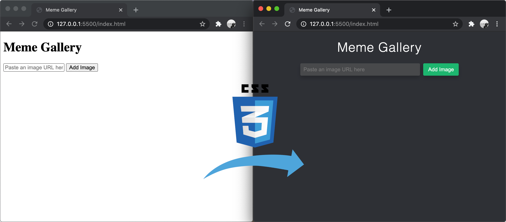

# Initial HTML Page & Styling

Although we are building an interactive JavaScript app, the foundation of any web application is always HTML and CSS. So we will begin there.

By the end of this section of the project, your page should closely resemble the example below.

<p align="middle">
  
</p>

Let's dive right in!

## Set up HTML and CSS files

First off, we need to create the necessary files for our HTML and CSS.

1. Create a new file named `index.html`.
1. Create a new file named `styles.css`.
1. Create an [HTML Skeleton](https://github.com/Learning-Fuze/lfz-prep-lessons/tree/master/exercises/html-skeleton) inside your `index.html` file.
    - Title your HTML document **Meme Gallery**.
    - Leave the `<body>` element empty for now.
1. Add a `<link>` tag to the `<head>` of your HTML document to link your `styles.css` file. The `<link>` tag should have two attributes:
    - a `rel` attribute of `"stylesheet"`
    - an `href` attribute of `"styles.css"`
1. Open `index.html` in your web browser.
1. If you open the **Network** tab of the Dev Tools in your browser and refresh the page, you should see both the `index.html` and `styles.css` loading.
    <p align="middle">
      
    </p>

## The Document Body

Our page has a relatively simple structure, let's build the HTML for it now.

1. Add a `<header>` element to the `<body>` of your HTML.
1. Within the `<header>`:
    - Add a child `<h1>` element containing the text **Meme Gallery**.
    - Add a child `<input>` element. It should have two [attributes](https://github.com/Learning-Fuze/lfz-prep-lessons/tree/master/exercises/html-syntax) for now:
        - `type` set to `"url"`
        - and `placeholder` set to `"Paste an image URL here"`
    - Now, add a child `<button>` element containing the text **Add Image**
1. Last, add a `<main>` element to the `<body>` of your HTML. This element is a sibling of the `<header>`. It's also where our images will nest later on. For now we'll leave it empty.

At this stage, you should be able to load your `index.html` in the browser and see something like this:

<p align="middle">
  
</p>

It looks kind of plain, but believe it or not, this is _all_ of the HTML we need!

## Initial Styling

It's incredible what some web design and well-structured CSS can do for an otherwise sterile HTML document. Here is a side-by-side comparison of the transformation that our initial CSS will do for us.

<p align="middle">
  
</p>

Let's begin!

1. Open your `styles.css` file in your code editor.
1. Create a new CSS rule using the [universal selector (`*`)](https://github.com/Learning-Fuze/lfz-prep-lessons/tree/master/exercises/css-selectors) to reset `box-sizing` for every element in the document to `border-box`. This will help us manage our margin and padding in an intuitive way. You can read more about [`box-sizing: border-box` in the MDN Web Docs](https://developer.mozilla.org/en-US/docs/Web/CSS/box-sizing).
1. Create a new CSS rule that targets the `body` element and:
    - sets its `margin` to `0`
    - sets its `font-family` to `sans-serif`
    - sets its `background-color` to `#2e3035` (a dark grey color)
1. All of the text inside our `<header>` element will be centered, so create a new CSS rule that targets the `header` and sets its `text-align` to `center`.
1. We'd like the text inside of our `h1` to look a little more modern, so create a new CSS selector for it to:
    - set its `font-weight` to `200`
    - set its `letter-spacing` to `1px`
1. We want to apply some fairly aggressive styling to our `input`. Fortunately, CSS has us covered. Create a new CSS rule for your `input` to:
    - set its `width` to `300px` so that it fills up more horizontal room on the page.
    - set its `padding-left` and `padding-right` to `8px` to keep its placeholder nicely spaced away from its edges.
    - set its `margin-right` to `4px` to add a little breathing room between the input and the button next to it.
    - finally, give it a custom `background-color` of `#48494b` (a different dark gray) so that it pops out a little from the background.
1. Now apply some styles to your `button` with a new CSS selector that:
    - sets `padding-top` and `padding-bottom` to `8px`
    - sets `padding-left` and `padding-right` to `12px`
    - sets its `background-color` to `#1bb76e` (a fancy green accent)
1. Verify that your document looks super-weird like this:
    <p align="middle">
      
    </p>
    <h3>🤨</h3>
1. Take a deep breath. We're almost there!
1. There are some similar styles between our goal input and button, so now, create a new ["group" CSS selector](https://developer.mozilla.org/en-US/docs/Web/CSS/Selector_list) for _both_ the `input` _and_ the `button` that does the following:
    - sets their `height` to `31px`
    - removes their `border` by setting it to `none`
    - sets their `border-radius` to `3px` for subtly rounded corners
    - adds a `box-shadow` to pop them off of the page a bit. You can use this as the value: `0 6px 10px 0 rgba(0, 0, 0, 0.2)`

    These few styles should have made a **big** difference in how your `input` and `button` look, yes?
1. If you click on your `button` or into your `input`, you might notice that they have a gross `outline` when you `:focus` on them. We'll need to create a "group" CSS selector for both [`input:focus` and `button:focus`](https://www.w3schools.com/css/css_pseudo_classes.asp) to turn off the `outline` (set it to `none`).
1. Finally (for now), let's fix our remaining issue. The `color` of our `h1`, `input`, and `button` are not right. Set them all to `#ffffff` (white) now using another new "group" CSS selector. _Et voilá!_
    <p align="middle">
      
    </p>

## Moving On

Hopefully you've seen just how vital HTML and CSS are to developing a nice user interface. In the next section, we'll begin adding functionality to our small app, but be careful not to forget that a clear, visually-appealing design is a _very_ large part of usable software.

Let's start adding some functionality with JavaScript in the [next section](ACCEPTING_USER_INPUT.md).

If you want, you can triple-check your code against a reference solution. **However, if you got stuck, be sure to re-read the instructions _very slowly_ and ask questions of the instructors rather than simply copying these examples.**

### `index.html`

```html
<!DOCTYPE html>
<html lang="en">
<head>
  <meta charset="UTF-8">
  <meta name="viewport" content="width=device-width, initial-scale=1.0">
  <title>Meme Gallery</title>
  <link rel="stylesheet" href="styles.css">
</head>
<body>
  <header>
    <h1>Meme Gallery</h1>
    <input type="url" placeholder="Paste an image URL here">
    <button>Add Image</button>
  </header>
  <main></main>
  <script src="main.js"></script>
</body>
</html>
```

### `styles.css`

```css
* {
  box-sizing: border-box;
}

body {
  margin: 0;
  font-family: sans-serif;
  background-color: #2e3035;
}

header {
  text-align: center;
}

h1 {
  font-weight: 200;
  letter-spacing: 1px;
}

input {
  width: 300px;
  padding: 0 8px;
  margin-right: 4px;
  background-color: #48494b;
}

button {
  padding: 8px 12px;
  background-color: #1bb76e;
}

input,
button {
  height: 31px;
  border: none;
  border-radius: 3px;
  box-shadow: 0 6px 10px 0 rgba(0, 0, 0, 0.2);
}

input:focus,
button:focus {
  outline: none;
}

header,
input,
button {
  color: #ffffff
}
```
