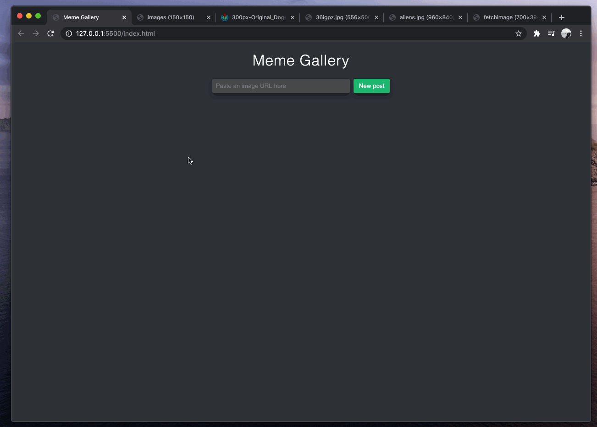

# lfz-prep-meme-gallery

Instructions for building a meme gallery using introductory JavaScript.

## Introduction

Congratulations on completing the LFZ Prep course at LearningFuze! This project will help you apply JavaScript concepts that you learned during your studies.

For this project, you will be building a simple interactive Meme Gallery as demonstrated in the example below.

<p align="middle">
  
</p>

As you can see, the user can enter a URL to any image and it will be added to the gallery when they click a button.

## Getting Started

### Create a Repository

To begin, you'll need a GitHub repository to commit your code to. Create a new repository on the GitHub website now. There are steps below the following image to help you out.

<p align="middle">
  
</p>

1. Leave the **Repository template** set to **No template**.
1. Leave the **Owner** set to your own GitHub username.
1. Name your repository **`meme-gallery`**.
1. Give it the following description: **An interactive HTML, CSS, and JavaScript app.**
1. Leave the repository set to **Public**.
1. Check the box that says **Initialize this repository with a README**.
1. Click the **Create repository** button.

### Clone the Repository

Once your GitHub repository has been created, you'll need to clone it to your computer with the `git` command.

1. Open your Terminal (on Mac) or Git Bash (on Windows).
1. Change to your `repos/` directory with the following command:
    ```bash
    cd ~/repos
    ```
1. On your repository's GitHub page, find and click the **Code** button.
1. Make sure to change the clone option to **SSH** and copy the URL that is displayed.
1. Back in your Terminal (Mac) or Git Bash (Windows), clone your repository with the `git clone` command. You'll need to paste the URL you copied instead of the example below.<br>
    **Don't copy-paste the below command, it's just an example. You should use your own SSH URL.**
    ```bash
    git clone git@github.com:my-profile/meme-gallery.git
    ```
1. Then, change directories to your freshly cloned repository.
    ```bash
    cd meme-gallery
    ```
1. Lastly, open your new `portfolio` directory in your code editor!

## Meme Gallery Project Workflow

This project is broken into three major phases:

1. Initial HTML Page and Styling
1. Accepting User Input
1. Dynamically Rendering Images

Let's get started with setting up our initial HTML page and styling in the [first section](HTML_PAGE_AND_STYLING.md).
